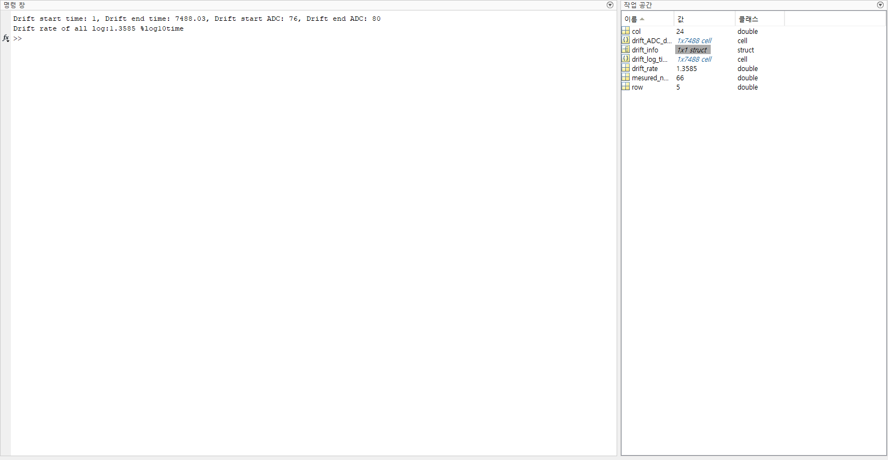

# klib2-ReadKitronyxCsv
 GitHub repository for reading Kitronyx snapshot files and log files

# Code Purpose
Collection of sample code and source code in various programming languages for aggregating data from Snapshot and Log folders' converted CSV files using Kitornyx products

# FolderTree
```
CalculateDriftRate
│  README.md
│  README.pdf
│
├─res
│      MatLABSampleResult.png
│
├─SampleCode
│  │  calc_drift_rate.m
│  │  main.m
│  │  Read_ConvertLogFile_1_dimension_data.m
│  │
│  └─Drift_Sample_ConvertLogFilePage 01
│          Drift_AdcData-1d.csv
│          Drift_AdcData-2d.csv
│
└─src
        calc_drift_rate.m
```


# MATLAB
Version: R2023b Update 7 (23.2.0.2515942) 64bit January 30, 2024  

## Code Description
```
calc_drift_rate.m
    - MATLAB file containing a function to calculate drift rate for all log data
    - Returns [drift_rate] when given a drift infomation struct.
    - drift infomation struct format example:
        - drift_info.Time_start
        - drift_info.Time_end
        - drift_info.ADC_begin
        - drift_info.ADC_end 
```

