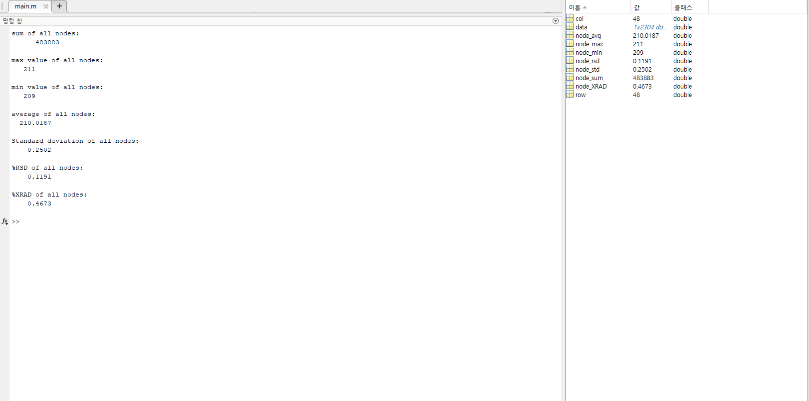

# klib2-ReadKitronyxCsv
 GitHub repository for reading Kitronyx snapshot files and log files

# Code Purpose
Collection of sample code and source code in various programming languages for aggregating data from Snapshot and Log folders' converted CSV files using Kitornyx products


# FolderTree
```
DataStatistics
│  README.md
│  README.pdf
│
├─res
│      MatLABSampleResult.png
│
├─SampleCode
│  │  calc_node_rsd.m
│  │  calc_node_SumMaxMinAvg.m
│  │  calc_node_XRAD.m
│  │  main.m
│  │  Read_snapshot_1_dimension_data.m
│  │
│  └─SampleSnapshotData
│          20240227T170929_AdcData-1d.csv
│          20240227T170929_AdcData-2d.csv
│          20240227T170929_ForceData-1d.csv
│          20240227T170929_ForceData-2d.csv
│          20240227T170929_snapshot-frame.jpg
│          20240227T170929_snapshot-real_time_analyzer.jpg
│
└─src
        calc_node_rsd.m
        calc_node_SumMaxMinAvg.m
        calc_node_XRAD.m
```

# MATLAB
Version: R2023b Update 7 (23.2.0.2515942) 64bit January 30, 2024  

## Code Description
```
calc_node_SumMaxMinAvg.m
    - MATLAB file containing a function to calculate sum, average, maximum, and minimum values for all nodes.
    - Returns [node_sum, node_max,node_min,node_avg] when given a 1D matrix data as a parameter.
    - node_sum: Sum of all nodes
    - node_avg: Average of all nodes
    - node_max: Max value of all nodes
    - node_min: Min value of all nodes

calc_node_rsd.m
    - MATLAB file containing a function to calculate Standard deviation and Relative Standard deviation values for all nodes.
    - Returns [node_std, node_rsd] when given a 1D matrix data as a parameter.
    - node_std: Standard deviation of all nodes
    - node_rsd: %RSD of all nodes

calc_node_XRAD.m
    - MATLAB file containing a function to calculate %XRAD values for all nodes.
    - Returns [node_XRAD] when given a 1D matrix data as a parameter.
    - node_XRAD: %XRAD of all nodes

```


