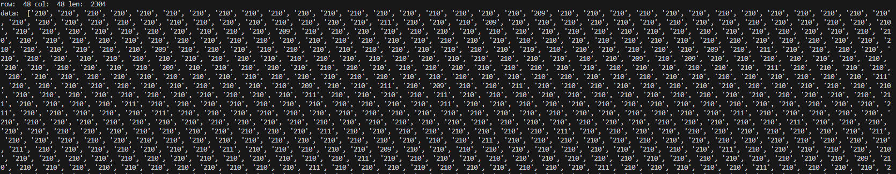
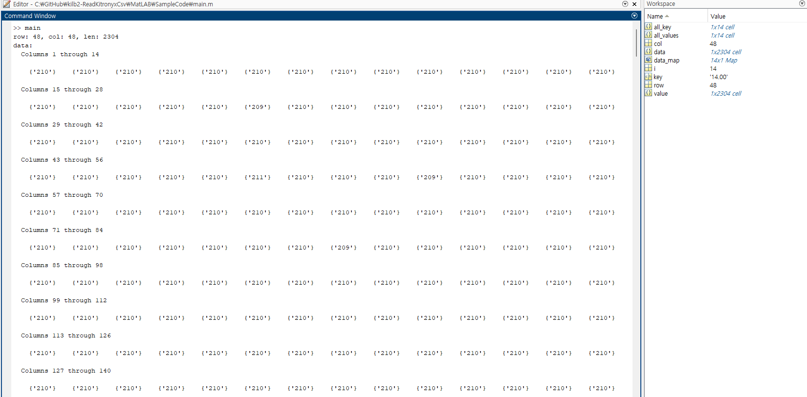

# klib2-ReadKitronyxCsv
 GitHub repository for reading Kitronyx snapshot files and log files

# Code Purpose
Collection of sample code and source code in various programming languages for aggregating data from Snapshot and Log folders' converted CSV files using Kitornyx products


# FolderTree
```
ReadKitronyxCsv
|   LICENSE
|   README.md
|
+---MatLAB
|   +---SampleCode
|   |   |   main.m
|   |   |   ReadConvertLogFile1DimensionData.m
|   |   |   ReadSnapshot1DimensionData.m
|   |   |
|   |   +---SampleSnapshotData
|   |   |       20240227T170929_AdcData-1d.csv
|   |   |       20240227T170929_AdcData-2d.csv
|   |   |       20240227T170929_ForceData-1d.csv
|   |   |       20240227T170929_ForceData-2d.csv
|   |   |       20240227T170929_snapshot-frame.jpg
|   |   |       20240227T170929_snapshot-real_time_analyzer.jpg
|   |   |
|   |   \---Sample_ConvertLogFilePage 01
|   |           20240311T142511_AdcData-1d.csv
|   |           20240311T142511_AdcData-2d.csv
|   |           20240311T142511_ForceData-1d.csv
|   |           20240311T142511_ForceData-2d.csv
|   |
|   \---src
|           ReadConvertLogFile1DimensionData.m
|           ReadSnapshot1DimensionData.m
|
+---Python
|   +---SampleCode
|   |   |   main.py
|   |   |   ReadKitronyxCsv.py
|   |   |
|   |   +---SampleSnapshotData
|   |   |       20240227T170929_AdcData-1d.csv
|   |   |       20240227T170929_AdcData-2d.csv
|   |   |       20240227T170929_ForceData-1d.csv
|   |   |       20240227T170929_ForceData-2d.csv
|   |   |       20240227T170929_snapshot-frame.jpg
|   |   |       20240227T170929_snapshot-real_time_analyzer.jpg
|   |   |
|   |   +---Sample_ConvertLogFilePage 01
|   |   |       20240311T142511_AdcData-1d.csv
|   |   |       20240311T142511_AdcData-2d.csv
|   |   |       20240311T142511_ForceData-1d.csv
|   |   |       20240311T142511_ForceData-2d.csv
|   |   |
|   |   \---__pycache__
|   \---src
|           ReadKitronyxCsv.py
|
\---res
        MatLABSampleResult.png
        PythonSampleResult.png
```
# Python
Program tools : Vs Code (Vesion 1.87.1)  
Vs code Python Version: v2024.2.1  
 ## Code Description
 ```
ReadKitronyxCsv.py
    -.Collection of functions to read Kitronyx snapshot and log CSV files
      
    def ReadSnapshot1DimensionData(_path):
    - Function to read snapshot 1D files
    - Takes a 1D CSV path as a parameter and returns [row, col, data]
    - row: ROW - number of columns
    - col: COL - number of rows
    - data: Matrix data of size ROW*COL

    def ReadConvertLogFile1DimensionData(_path):
    - Function to read log 1D files
    - Takes a 1D CSV path as a parameter and returns [row, col, data_dict]
    - row: ROW - number of columns
    - col: COL - number of rows
    - data_dict: Dictionary format data
        - keys: Time values
        - values: Matrix data of size ROW*COL

```




# MathLAB
Version: R2023b Update 7 (23.2.0.2515942) 64bit January 30, 2024  

## Code Description
```
ReadSnapshot1DimensionData.m
    - MATLAB file containing a function to read snapshot 1D files
    - Returns [row, col, data] when given a 1D CSV path as a parameter.
    - row: ROW - number of columns
    - col: COL - number of rows
    - data: Cell array data of size ROW*COL

ReadConvertLogFile1DimensionData.m
    - MATLAB file containing a function to read log 1D files
    - Returns [row, col, data_dict] when given a 1D CSV path as a parameter.
    - row: ROW - number of columns
    - col: COL - number of rows
    - data_dict: Map format data
        - keys: Time values
        - values: Cell array data of size ROW*COL
```

