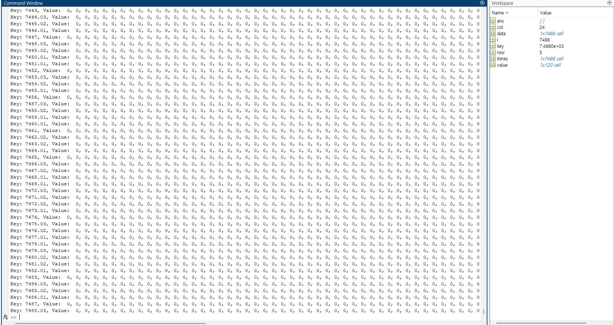
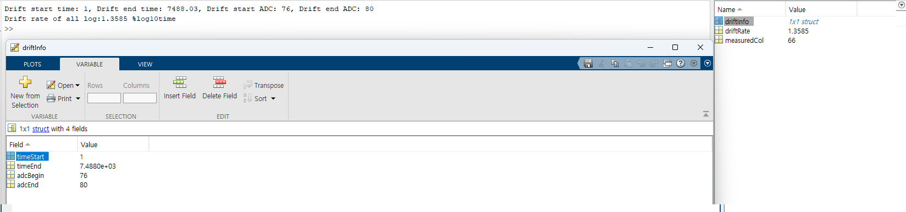

# Code Purpose
This repository contains a collection of sample code and source code in MATLAB for aggregating data from Snapshot and Log folders' converted CSV files using Kitronyx products.

# FolderTree
```
│  README.md
│  README.pdf
├─res
├─sample
│  ├─calculate_drift_rate
│  │  └─converted_log_data
│  ├─data_statistics
│  │  └─snapshot_data
│  └─read_kitronyx_csv
│      ├─converted_log_data
│      └─snapshot_data
└─src
    ├─calculate_drift_rate
    ├─data_statistics
    └─read_kitronyx_csv
```

# MATLAB
Version: R2023b Update 7 (23.2.0.2515942) 64bit January 30, 2024  


# How to Use Sample Code
To use the sample code in each folder:

1. Navigate to the desired sample folder (e.g., sample/calculate_drift_rate, sample/data_statistics, sample/read_kitronyx_csv).
2. Run the ***'main.m'*** file in the folder to execute the corresponding sample code.  

This will allow you to test and observe how each function processes the data.


## Code Description
```
read_snapshot_1d_data.m
    - MATLAB file containing a function to read snapshot 1D files
    - Returns [row, col, data] when given a 1D CSV path as a parameter.
    - row: ROW - number of columns
    - col: COL - number of rows
    - data: Cell array data (size ROW*COL)

read_converted_logfile_1D_data.m
    - MATLAB file containing a function to read log 1D files
    - Returns [row, col, times, data] when given a 1D CSV path as a parameter.
    - row: ROW - number of columns
    - col: COL - number of rows
    - times: Cell array - Time values
    - data_dict: Cell array data (size ROW*COL)
```

```
calc_node_sum_max_min_avg.m
    - MATLAB file containing a function to calculate sum, average, maximum, and minimum values for all nodes.
    - Returns [nodeSum, nodeMax,nodeMin,nodeAvg] when given a 1D matrix data as a parameter.
    - nodeSum: Sum of all nodes
    - nodeAvg: Average of all nodes
    - nodeMax: Max value of all nodes
    - nodeMin: Min value of all nodes

clac_node_rsd.m
    - MATLAB file containing a function to calculate Standard deviation and Relative Standard deviation values for all nodes.
    - Returns [nodeStd, nodeRsd] when given a 1D matrix data as a parameter.
    - nodeStd: Standard deviation of all nodes
    - nodeRsd: %RSD of all nodes

calc_node_xrad.m
    - MATLAB file containing a function to calculate %XRAD values for all nodes.
    - Returns [nodeXrad] when given a 1D matrix data as a parameter.
    - nodeXrad: %XRAD of all nodes
```


```
calcualte_drift_rate.m
    - MATLAB file containing a function to calculate drift rate for all log data
    - Returns [drift_rate, driftInfo] when given a drift value and drift information struct.
    - drift infomation struct format example:
        - driftInfo.timeStart
        - driftInfo.timeEnd
        - driftInfo.adcBegin
        - driftInfo.adcEnd 
```


