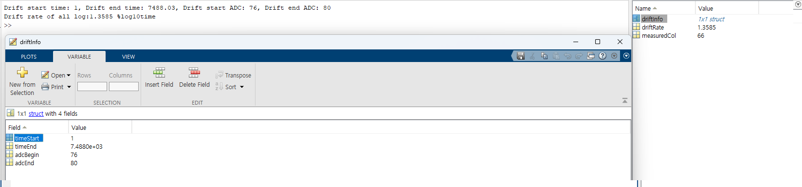

# calcualte_drift_rate
Here is a MATLAB function that reads Kitronyx log data and calculates the drift (rate of change) over time:

# FolderTree
```
calcualte_drift_rate
|   README.md
|   README.pdf
|
+---res
|       MatLABSampleResult.png
|
+---sample
|   |   calcualte_drift_rate.m
|   |   main.m
|   |   read_converted_logfile_1D_data.m
|   |
|   \---converted_log_data
|           Drift_AdcData-1d.csv
|           Drift_AdcData-2d.csv
|
\---src
        calcualte_drift_rate.m
```


# MATLAB
Version: R2023b Update 7 (23.2.0.2515942) 64bit January 30, 2024  

## Code Description
```
calcualte_drift_rate.m
    - MATLAB file containing a function to calculate drift rate for all log data
    - Returns [drift_rate, driftInfo] when given a drift value and drift information struct.
    - drift infomation struct format example:
        - driftInfo.timeStart
        - driftInfo.timeEnd
        - driftInfo.adcBegin
        - driftInfo.adcEnd 
```

