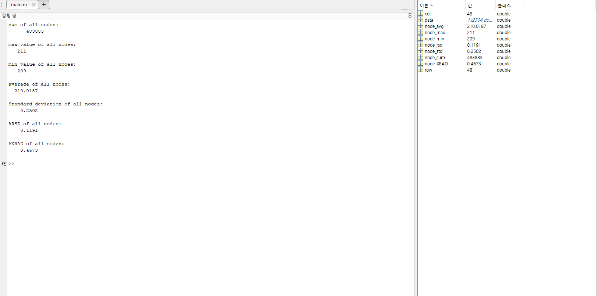

# data_statistics
  Here is an enhanced function that reads Kitronyx snapshot data and calculates the maximum value, minimum value, average value, sum, XRAD, and RSD (Relative Standard Deviation):

# FolderTree
```
DataStatistics
|   README.md
|   README.pdf
|
+---res
|       MatLABSampleResult.png
|
+---sample
|   |   calc_node_sum_max_min_avg.m
|   |   calc_node_xrad.m
|   |   clac_node_rsd.m
|   |   main.m
|   |   read_snapshot_1d_data.m
|   |
|   \---snapshot_data
|           20240227T170929_AdcData-1d.csv
|           20240227T170929_AdcData-2d.csv
|           20240227T170929_ForceData-1d.csv
|           20240227T170929_ForceData-2d.csv
|           20240227T170929_snapshot-frame.jpg
|           20240227T170929_snapshot-real_time_analyzer.jpg
|
\---src
        calc_node_sum_max_min_avg.m
        calc_node_xrad.m
        clac_node_rsd.m
```

# MATLAB
Version: R2023b Update 7 (23.2.0.2515942) 64bit January 30, 2024  

## Code Description
```
calc_node_sum_max_min_avg.m
    - MATLAB file containing a function to calculate sum, average, maximum, and minimum values for all nodes.
    - Returns [nodeSum, nodeMax,nodeMin,nodeAvg] when given a 1D matrix data as a parameter.
    - nodeSum: Sum of all nodes
    - nodeAvg: Average of all nodes
    - nodeMax: Max value of all nodes
    - nodeMin: Min value of all nodes

clac_node_rsd.m
    - MATLAB file containing a function to calculate Standard deviation and Relative Standard deviation values for all nodes.
    - Returns [nodeStd, nodeRsd] when given a 1D matrix data as a parameter.
    - nodeStd: Standard deviation of all nodes
    - nodeRsd: %RSD of all nodes

calc_node_xrad.m
    - MATLAB file containing a function to calculate %XRAD values for all nodes.
    - Returns [nodeXrad] when given a 1D matrix data as a parameter.
    - nodeXrad: %XRAD of all nodes

```


