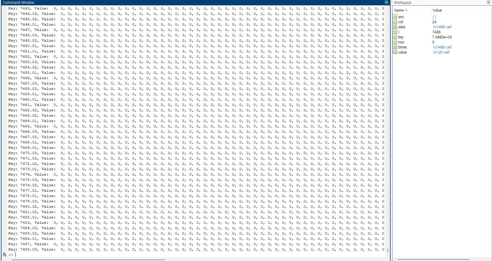

# read_kitronyx_csv 
Collection of sample code and source code in various programming languages for aggregating data from Snapshot and Log folders' converted CSV files using Kitornyx products


# FolderTree
```
read_kitronyx_csv
|   README.md
|   README.pdf
|
+---res
|       MatLABSampleResult.png
|
+---sample
|   |   main.m
|   |   read_converted_logfile_1D_data.m
|   |   read_snapshot_1d_data.m
|   |
|   +---SampleSnapshotData
|   |       20240227T170929_AdcData-1d.csv
|   |       20240227T170929_AdcData-2d.csv
|   |       20240227T170929_ForceData-1d.csv
|   |       20240227T170929_ForceData-2d.csv
|   |       20240227T170929_snapshot-frame.jpg
|   |       20240227T170929_snapshot-real_time_analyzer.jpg
|   |
|   \---Sample_ConvertLogFilePage 01
|           20240227T170929_AdcData-1d.csv
|
\---src
        read_converted_logfile_1D_data.m
        read_snapshot_1d_data.m

```

# MathLAB
Version: R2023b Update 7 (23.2.0.2515942) 64bit January 30, 2024  

## Code Description
```
ReadSnapshot1DimensionData.m
    - MATLAB file containing a function to read snapshot 1D files
    - Returns [row, col, data] when given a 1D CSV path as a parameter.
    - row: ROW - number of columns
    - col: COL - number of rows
    - data: Cell array data (size ROW*COL)

ReadConvertLogFile1DimensionData.m
    - MATLAB file containing a function to read log 1D files
    - Returns [row, col, times, data] when given a 1D CSV path as a parameter.
    - row: ROW - number of columns
    - col: COL - number of rows
    - times: Cell array - Time values
    - data_dict: Cell array data (size ROW*COL)
```

