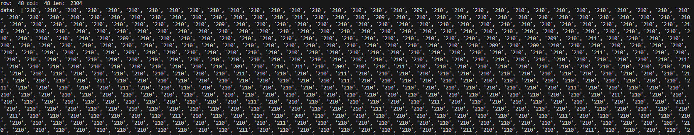

# klib2-ReadKitronyxCsv
 GitHub repository for reading Kitronyx snapshot files and log files

# Code Purpose
Collection of sample code and source code in various programming languages for aggregating data from Snapshot and Log folders' converted CSV files using Kitornyx products


# FolderTree
```
│  README.md
│  README.pdf
│
├─res
│      read_kitronyx_csv.png
│
├─sample
│  └─read_kitronyx_csv
│      │  main.py
│      │  ReadKitronyxCsv.py
│      │
│      ├─converted_log_data
│      │      20240311T142511_AdcData-1d.csv
│      │      20240311T142511_AdcData-2d.csv
│      │      20240311T142511_ForceData-1d.csv
│      │      20240311T142511_ForceData-2d.csv
│      │
│      └─snapshot_data
│              20240227T170929_AdcData-1d.csv
│              20240227T170929_AdcData-2d.csv
│              20240227T170929_ForceData-1d.csv
│              20240227T170929_ForceData-2d.csv
│              20240227T170929_snapshot-frame.jpg
│              20240227T170929_snapshot-real_time_analyzer.jpg
│
└─src
    └─read_kitronyx_csv
            ReadKitronyxCsv.py
```
# Python
Program tools : Vs Code (Vesion 1.87.1)  
Vs code Python Version: v2024.2.1  

 ## Code Description

 ### ReadKitronyxCsv
 ```
ReadKitronyxCsv.py
    -.Collection of functions to read Kitronyx snapshot and log CSV files
      
    def ReadSnapshot1DimensionData(_path):
    - Function to read snapshot 1D files
    - Takes a 1D CSV path as a parameter and returns [row, col, data]
    - row: ROW - number of columns
    - col: COL - number of rows
    - data: Matrix data of size ROW*COL

    def ReadConvertedLogFile1DimensionData(_path):
    - Function to read log 1D files
    - Takes a 1D CSV path as a parameter and returns [row, col, data_dict]
    - row: ROW - number of columns
    - col: COL - number of rows
    - data_dict: Dictionary format data
        - keys: Time values
        - values: Matrix data of size ROW*COL

```


